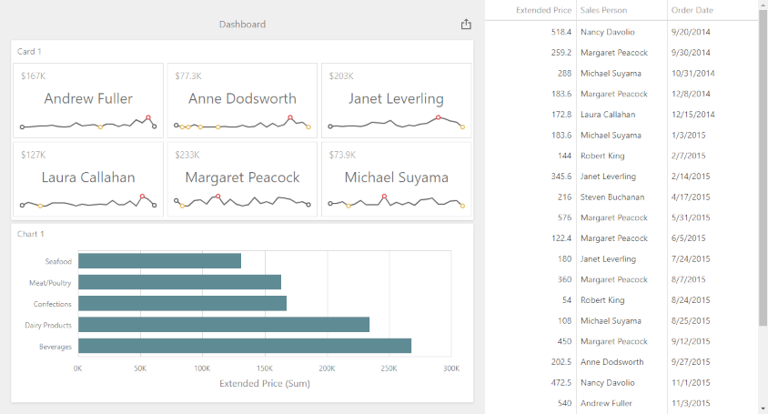

<!-- default badges list -->

<!-- default badges end -->

# ASP.NET Core Dashboard - How to obtain underlying data for the specified dashboard item

The example shows how to get underlying data for the specified dashboard item. Underlying data is displayed in the `dxDataGrid` widget placed next to the Web Dashboard.

The example uses the [ViewerApiExtension.requestUnderlyingData](https://docs.devexpress.com/Dashboard/js-DevExpress.Dashboard.ViewerApiExtension?p=netframework#js_devexpress_dashboard_viewerapiextension_requestunderlyingdata) method and passes the component name of the dashboard item and specific parameters to request data.

## Files to Review
- [UnderlyingData.js](./CS/AspNetCoreDashboard_UnderlyingData/wwwroot/js/UnderlyingData.js)
- [_Layout.cshtml](./CS/AspNetCoreDashboard_UnderlyingData/Pages/_Layout.cshtml)
- [Index.cshtml](./CS/AspNetCoreDashboard_UnderlyingData/Pages/Index.cshtml)

## Documentation

- [Client-Side API Overview for ASP.NET Core Dashboard](https://docs.devexpress.com/Dashboard/400192/web-dashboard/aspnet-core-dashboard-control/client-side-api-overview)
- [Obtain Underlying and Displayed Data in the ASP.NET Core Dashboard Control](https://docs.devexpress.com/Dashboard/403990)
- [Obtain Underlying and Displayed Data in Dashboard Control for JavaScript Applications
](https://docs.devexpress.com/Dashboard/403003/web-dashboard/dashboard-control-for-javascript-applications-jquery-knockout-etc/obtain-underlying-and-displayed-data)

## More Examples

- [Dashboard for ASP.NET Core - How to obtain a dashboard item's client data](https://github.com/DevExpress-Examples/asp-net-core-dashboard-get-client-data)
- [Dashboard for ASP.NET Core - How to obtain a dashboard item's underlying data for a clicked visual element](https://github.com/DevExpress-Examples/asp-net-core-dashboard-get-underlying-data-for-clicked-item)
- [Dashboard for MVC - How to obtain a dashboard item's client data](https://github.com/DevExpress-Examples/asp-net-mvc-dashboard-get-client-data)
- [Dashboard for MVC - How to obtain underlying data for the specified dashboard item](https://github.com/DevExpress-Examples/asp-net-mvc-dashboard-display-item-underlying-data)
- [Dashboard for MVC - How to obtain a dashboard item's underlying data for a clicked visual element](https://github.com/DevExpress-Examples/asp-net-mvc-dashboard-get-underlying-data-for-clicked-item)
- [Dashboard for Web Forms - How to obtain a dashboard item's client data](https://github.com/DevExpress-Examples/how-to-obtain-a-dashboard-items-client-data-in-the-aspnet-dashboard-control-t492284)
- [Dashboard for Web Forms - How to obtain a dashboard item's underlying data for a clicked visual element](https://github.com/DevExpress-Examples/aspxdashboard-how-to-obtain-a-dashboard-items-underlying-data-for-a-clicked-visual-element-t492257)
- [Dashboard for Web Forms - How to obtain underlying data for the specified dashboard item](https://github.com/DevExpress-Examples/aspxdashboard-how-to-obtain-underlying-data-for-the-specified-dashboard-item-t518504)
